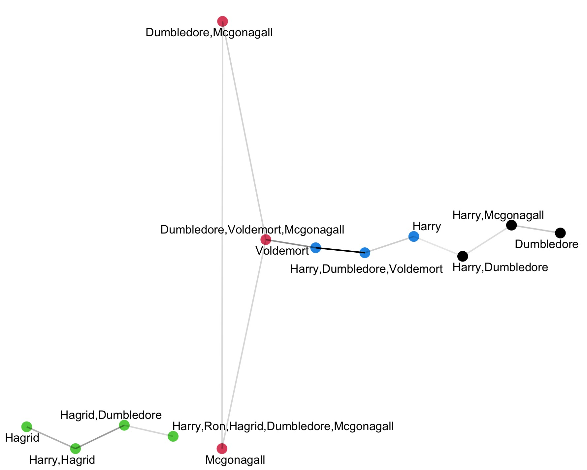
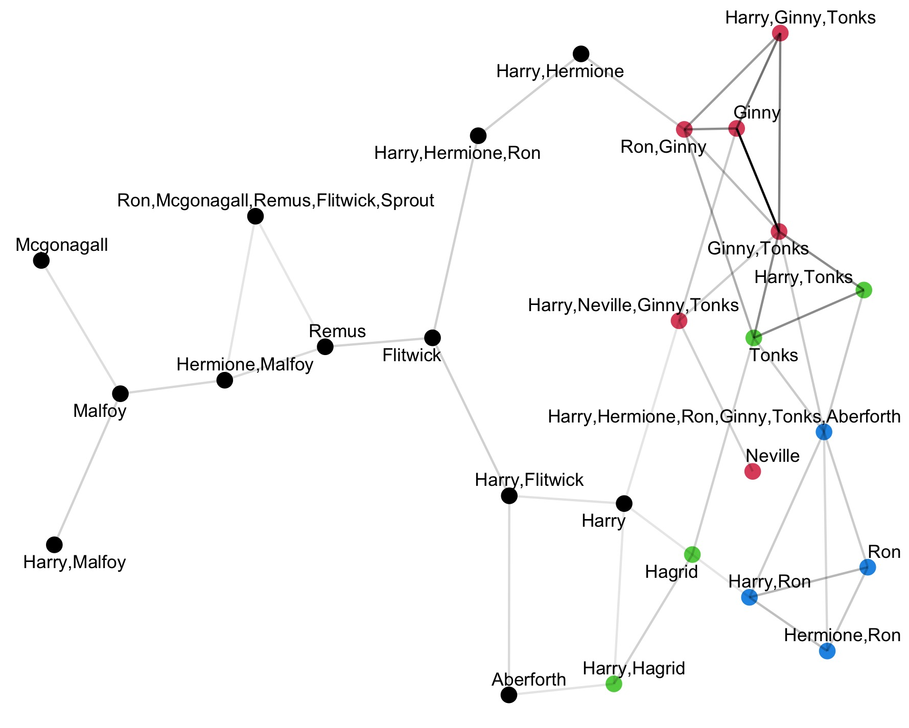

```{r setup, include=FALSE}
knitr::opts_chunk$set(echo = TRUE)
```

# Harry Potter and the Semantic Similarityof Words

## Abstract

Word embedding is a natural language processing (NLP) technique used to quantify the similar between words by mathematically modelling the co-occurrence of words in a body of text [2]. Word embedding is widely used in many applications of text analysis, such as finding analogies [2], identifying features in authorship [5] and relationship strengths between characters in works of fiction [4]. An opportunity to apply work embedding techniques in popular works of fiction presented itself with the Harry Potter text package made available in R, on CRAN. The Harry Potter text package contained the full text of all seven original series book presents an opportunity to apply text analysis techniques to uncover interesting insights. In this exploratory work, we applied word embedding techniques and text network visualization package [1], we analyzed and visualized character interactions in different parts of the stories, to see how different characters associate in different settings. The results of this study show that word embedding techniques can be applied to extract insights of character interactions in Harry Potter texts by J.K. Rowling.

## Related Work

Analysis of works of fiction at the word level may reveal interesting insight of literary value, and sometimes it may even have surprising real world applications. In the literary sphere, Peng et al. published an overview on the signature of authorship in literary styles. It has been established that there is structure in text data that identifies authorship, which can be discovered by quantifying relevant features related to literary style. However, it is way more challenging is how to determine which sets of features contributes to authorship. [5]

In a more applicable twist, Fast et al. derived a knowledge base of human behavior from works of fiction using text analysis techniques. These researchers showed that computers understood human actions and were able to adjust their services to humans based on prediction of the human's next likely course of action. Their work revealed that fictional human lives mirrors real human lives quite closely. [3]

Lastly, in another study, Seo et al. constructed social networks for fictional characters. They visualized fictional characters as vertices and diagrammed the relationship strengths between them as edges. Seo et al. analyzed topological structures of social network graphs to reveal hidden structure of fiction novels, to order works by graph topology as opposed to traditional categories. In their work, they were able to show that co-occurrence patterns reveal features hidden in the text. Interactions measured by statement distance between characters; i.e. co-occurrence of full character names in one statement suggest they are highly related. [4]

In this study, we created social network graphs in a similar approach as Seo et al. However, as opposed to character name occurrences, we used semantic similarity of words spoken by the characters (i.e. character dialogues in quotes) to visualize social closeness.

## Methods

### Locate Character Scenes and Appearances

Since the Harry Potter text package contained all text from the books in strings, we had to come up with a heuristic to determine how to extract and isolate text that represent social interactions. The chosen shortcut to quickly get relevant information about the position of characters as well as scenes of social interaction are determined by quotes, as conversations typically indicate social interactions. Going off of those assumptions, we then assumed based on our understanding of the English literature, that typically quotes are followed by signatures that designate which character spoke it (e.g. "...", said Harry). Therefore, obtaining some text character surrounding quotes will obtain the name of the character speaking. Additionally, some rules to simplify character name extraction. For example, Seo et al. ignored designated words used in place of character names (i.e. he, him, she, etc). For our purposes, to reduce complexity of analysis, we would want to obtain interesting diagrams in limited graph space. If our methods could identify characters' quotes by first name or heuristic common alias (ex. Malfoy instead of Draco), it would be sufficient.

### Quotes Extraction and Preparation

A regex pattern was used to match character dialogues enclosed by double quotation marks, along with a 15 letters head and 20 letters trailing tail; the resulting match was extracted from the text of books. Lists of characters' names use were sometimes referenced by list of popularity, or again based on personal preference (i.e. which characters' interactions might I wish to see). Character names were assigned by finding a match in the extracted dialogues.

### Use of TextNets Package

The R textnets package was used to create the Harry Potter characters social network graph. Two-mode network projection [1] was used to link up and show relationship between pairs of characters, although only one of the modes, namely "metadata" or character names as nodes are of interest.

Harry Potter data was prepped as a dataframe containing rows of extracted quotes form book text, and character names extracted from quotes. Then, PrepText function was used to tokenize, lemmatize and remove stopwords from quotes to prepare words for creating the network. PrepText function prepared a weighted adjacency matrix by transposing cross-product of the adjacency matrix with term-frequency inverse-document frequency matrix of words in the quotes [1]. In this way, word similarity was quantified.

## Conclusions

### Results

A. Harry Potter and the Philosopher Stone 75 Quotes Visualization

Text from Harry Potter and the Philosopher's Stone was processed. Quotes from the list of characters "Harry", "Hermione", "Ron", "Hagrid", "Dumbledore", "Voldemort", "Malfoy", "Neville", "Mcgonagall", "Snape", "Quirrell", "Ginny" were extracted. 75 quotes were selected, processed and visualized with textnet package.

\pagebreak



\pagebreak

B. Battle of Hogwarts (Harry Potter and the Deathly Hallows) 193 Quotes Visualization

Text from Harry Potter and the Deathly Hallows was processed. Quotes from the list of characters "Harry", "Hermione", "Ron", "Hagrid", "Neville", "Mcgonagall", "Ginny", "Tonks", "Remus", "Aberforth", "Kreacher", "Slughorn", "Flitwick", "Sprout", "Kingsley", "Lestrange", "Greyback", "Malfoy", "Lucius", "Narcissa", "Dolohov", "Nagini" were extracted. 193 quotes were selected, processed and visualized with textnet package.


\begin{center} Figure 2. Battle of Hogwarts character social network visualization \end{center}

### Discussion

In this work, we mapped word similarity in dialogue text to Harry Potter characters and created a social network graph to visualize character relationships. Quotes with head and tail letters were extracted from the Harry Potter book texts, and word similarity was calculated by the textnet package function PrepText, which created a weighted adjacency matrix using word embedding technique. The method of quantitative text analysis was then applied to two small samples of quotes. 

For both character social network visualizations (Figures 1,2), it was possible to decipher certain scenes from the books in our semantic understanding of the stories, from clusters of character nodes seen in the graphs. For example, in both visualizations, the character Hagrid (green nodes) is mainly associated with Harry. This is true as J.K. Rowling typically wrote about Hagrid whenever Harry went to visit Hagrid's hut, whereas others who were more central to the plot had more and different associations. The climax of Harry Potter and the Philosopher's Stone was the conflict between Harry and Voldemort, followed by Harry's conversation with Dumbledore to provide an explanation to prior events; this was reflected in the central blue nodes with strong edges between "Voldemort" and "Harry, Dumbledore, Voldemort". It was interesting to see that from a mere sample of 75 quotes this central relationship can be found. Due to the sample of quotes taken, the Battle of Hogwarts visualization wasn't comprehensive. Many scenes where characters interacted were not captured in the quotes obtained. The top right red cluster of nodes (Figure 2) reflect a scene at Hogsmeade where Ginny encountered Tonks, who had arrived to participate in battle. These social networks of characters based on word similarity in dialogues were accurate enough to reflect some sensible interactions that actually occurred in the stories.

### Limitations

The work conducted for this report was a very rudimentary exercise of data cleaning and wrangling, as well as usage of an academic open source visualization package. We list and address a few known limitations in our approach to Harry Potter text analysis: 

1. We are not English literature students, so we are lacking in knowledge about literary and text analysis; this makes it harder for us to design an experiment to uncover underlying structures in Harry Potter text that is meaningful
2. The heuristic methods used in obtaining quotes are not scientifically rigorous; the method to extract quotes by matching to pattern of double quotes with escape characters doesn't comprehensively obtain all quotes, and then to extract match of character name from it is likely even more inaccurate. While we were able to create and present visualizations that generate some interest, there isn't a whole lot of research rigor
3. The work we have done also isn't a comprehensive survey of the literature. The few visualizations we made and presented don't hold a candle to proper academic discussions. In terms of interest in researching the social structures underlying characters in fiction, we would need to conduct a more thorough and rigorously designed exploration of the Harry Potter books.

## References

1. C. Bail, “Text networks,” Text Networks. [Online]. Available:                 https://sicss.io/2018/materials/day3-text-analysis/text-networks/rmarkdown/SICSS_Text_Networks.html. [Accessed: 06-Dec-2021]. 
2. C. Bail, “Word Embeddings,” Word embeddings. [Online]. Available: https://cbail.github.io/textasdata/word2vec/rmarkdown/word2vec.html. [Accessed: 06-Dec-2021]. 
3. E. Fast, W. McGrath, P. Rajpurkar, and M. S. Bernstein, “Augur,” Proceedings of the 2016 CHI Conference on Human Factors in Computing Systems, 2016. 
4. J. Seo, G.-M. Park, S.-H. Kim, and H.-G. Cho, “Characteristic analysis of social network constructed from literary fiction,” 2013 International Conference on Cyberworlds, 2013. 
5. R. D. Peng and N. W. Hengartner, “Quantitative Analysis of Literary Styles,” The American Statistician, vol. 56, no. 3, pp. 175–185, 2002. 
6. V. Kantorovich, “Quantitative methods and the analysis of literature,” Soviet Studies in Literature, vol. 13, no. 3, pp. 86–96, 1977. 

